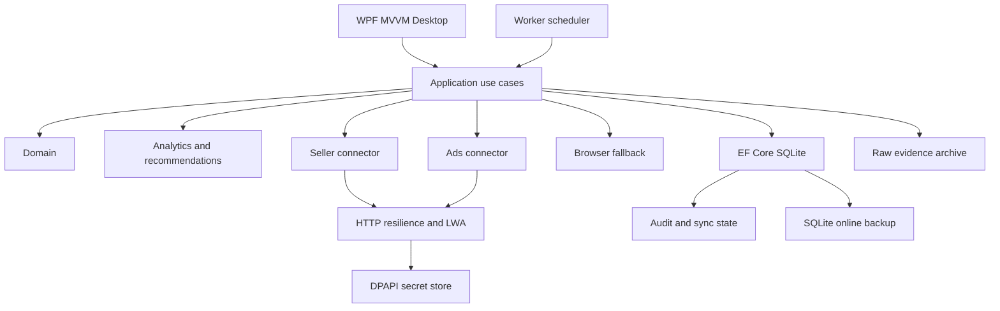
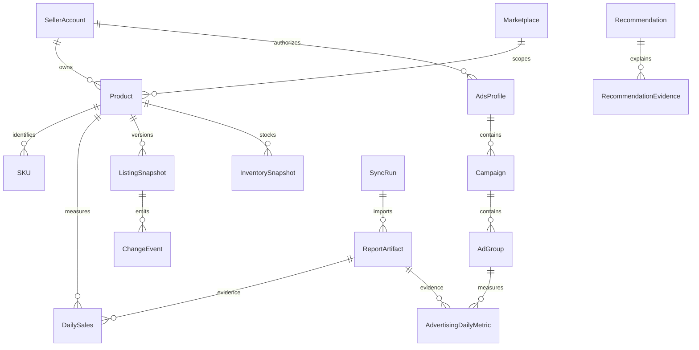

# WALKA Amazon Intelligence — authoritative implementation plan

Version 0.1.0 • 2026-09-17 • Windows x64 / .NET 10 / WPF

## 1. Product vision
Provide WALKA owners, advertising operators and inventory analysts with traceable seller and advertising intelligence in one local desktop application. Reduce spreadsheet reconciliation, identify wasted advertising spend, preserve listing history and explain profit and stock risks. Start read-only: report creation is permitted, business mutations are not. Future writes require proposal, explicit user approval, execution, authoritative re-read, verification and audit.

## 2. Scope and release gates
MVP: launchable WPF application, migrated SQLite, persisted settings, DPAPI secrets, LWA authentication, Seller Sales and Traffic reports, Ads Sponsored Products reporting, retained evidence, transactional idempotent import, audited sync, database dashboard and ASIN metrics, retry, reconciliation, backups, automated tests. Live credentials and account entitlement are external acceptance dependencies.

Phase 2: orders and items, catalog/SKU discovery, inventory, finance, product economics, listing/image/A+ versions, broader Ads entities, restartable backfill, deterministic recommendations and English/Arabic resources.

Phase 3: Brand Analytics and capability-aware SB/SD reports, deep comparative dashboards, browser fallback, installer and clean-machine acceptance.

Future/optional: approved Amazon mutations, multi-user database, remote backup, forecasting beyond deterministic velocity. No scope is complete solely because its interface exists.

## 3. System architecture
Desktop binds view models and never calls Amazon directly. Application coordinates use cases through collector and storage contracts. Domain owns identities, metrics and state transitions. Persistence owns EF mappings/migrations and transactional import. Infrastructure owns HTTP resilience, token protection and file evidence. Independent Seller/Ads connectors use official endpoints. Browser is a separate fallback, never an authentication bypass. Worker shares orchestration with Desktop and eventually supports unattended scheduling. Analytics computes nullable metrics and recommendations. Audit and backups are cross-cutting persistence services.

## 4. Planned source tree
`WalkaAmazonIntelligence.sln`; `src/WalkaAmazonIntelligence.{Domain,Application,Persistence,Infrastructure,Connectors.AmazonSeller,Connectors.AmazonAds,Connectors.Browser,Analytics,Worker,Desktop}/`; `tests/WalkaAmazonIntelligence.{Domain,Application,Persistence,Connectors,Analytics}.Tests/`; `docs/`; `scripts/`; `installer/`. Each project has its own csproj. Desktop owns Resources and ViewModels; Persistence owns Migrations. Tests own clearly labeled TEST_FIXTURE data. Development data and tooling caches live under ignored `.local/` at this root.

## 5. Database design
Every business key includes account, marketplace/profile, reporting date and relevant entity dimensions. Money uses decimal semantics with explicit currency; no cross-currency aggregation. Artifacts retain source/report/account/marketplace/range/generated/downloaded timestamps, path, SHA256, bytes, row count, status, retry and safe error. Facts reference artifacts. Replacement reports upsert natural keys, never add totals to prior imports. Report revisions supersede prior source facts transactionally. SQLite foreign keys and unique indexes enforce isolation and deduplication.

Entities by group: Marketplace, SellerAccount, AdsProfile; Product, SKU, ParentASIN, ChildASIN, ProductVariation; DailySales, TrafficMetric, Order, OrderItem; InventorySnapshot, FbaInventorySnapshot; Return, Refund, AmazonFee, PaymentTransaction, PriceSnapshot, Promotion; ListingSnapshot, ListingAttributeSnapshot, ListingIssue, ImageSnapshot, APlusSnapshot; Campaign, AdGroup, AdvertisedProduct, Keyword, Target, SearchTerm, PlacementMetric, AdvertisingDailyMetric, PurchasedProductMetric; SearchQueryPerformance, SearchCatalogPerformance, BrandAnalyticsMetric; SyncRun, SyncJob, ReportArtifact, ChangeEvent, Recommendation, RecommendationEvidence, AuditEvent, AppSetting, ConnectorState. These are planned entities; the tracker records implemented subsets.

## 6. Integration contracts and collection policy
Each collector validates configuration and supports bounded incremental and historical ranges with cancellation. Official schemas must be checked against primary documentation before implementation. SP-API uses LWA refresh/access tokens and regional endpoints; Ads uses LWA plus client ID and profile scope. Browser uses an owner-authenticated dedicated profile. Access is capability dependent, never assumed.

| Source | Mechanism / auth | Incremental / backfill | Pagination / limits | Deduplication / reconciliation / failures |
|---|---|---|---|---|
| Seller Sales & Traffic | Reports API GET_SALES_AND_TRAFFIC_REPORT / LWA | overlapping daily windows; bounded historical requests within availability | async report polling; report document download | account/market/date/ASIN; row and money totals; terminal failures recorded |
| Orders/items | Orders API / LWA and restricted authorization only when required | updated-after checkpoint overlap; range partitions | nextToken; endpoint usage plans | account/order/item key; order totals; no PII collected unnecessarily |
| Catalog/listings/A+ | Catalog Items, Listings Items, A+ APIs / LWA | daily snapshots; available history only | nextToken by endpoint | content hashes and immutable versions; unavailable entitlement explicit |
| Inventory/FBA | inventory APIs and reports / LWA | current snapshots; historical report availability | nextToken / report polling | SKU/location/time; compare quantities; never invent past inventory |
| Returns/refunds/fees/payments | reports and Finances APIs / LWA | overlap to accommodate adjustments; bounded backfill | API tokens and report limits | source transaction/component IDs; settlement reconciliation |
| Pricing/promotions | Product Pricing and eligible reports | daily/current observations; history starts at collection | endpoint-specific limits | SKU/time/source; inaccessible coupon data shown unavailable |
| Ads profiles/entities | profile and campaign APIs / LWA + client/profile headers | daily refresh; API-supported history | pagination differs by ad product | profile/entity ID; status/bid/budget change events |
| SP/SB/SD reporting | Ads reporting API / LWA + profile | rolling attribution refresh; report-type retention limits | async status and document, split date ranges | profile/date/entity/report dimensions; spend/sales totals |
| SQP/SCP/search terms/baskets/repeat purchase | entitled Brand Analytics reports / LWA | complete weekly/monthly periods; allowed retention | async reports; period options | account/market/period/query/ASIN; period totals |
| Browser fallback | explicit permitted report export / owner login | user-selected ranges and durable checkpoints | explicit waits and download events | same artifact importer; AUTH_REQUIRED on login, no security bypass |

All HTTP collectors bound retries (429, transient 5xx and network timeouts), honor Retry-After, use jittered exponential delay and cancellation. Permanent 4xx fail immediately; expired access tokens may refresh once. Report processing schedules a later poll rather than hot looping. No report request is automatically repeated after ambiguous creation without checking saved remote IDs. Regional endpoints are allowlisted. Pre-signed document URLs receive no API authorization headers and must use HTTPS. Raw document URLs and token payloads are never logged.

## 7. Security
LWA OAuth consent belongs to the account owner. Refresh tokens/client secrets are protected with Windows DPAPI CurrentUser; Credential Manager is an acceptable later alternative. Store only secret references in configuration/database. Access tokens live briefly in memory. No plaintext passwords, Authorization headers, secrets or token endpoint bodies in logs. Templates only in Git. Dedicated browser profile is sensitive and excluded from Git/backups. Backups exclude secrets; protect user directories with Windows ACLs, document portability limits of DPAPI and use disk encryption where needed. Production never falls back to fixtures. Settings changes and connection outcomes are audited without credentials.

## 8. Scheduler and recovery
Persist job type, scope, next run, attempt, lease, remote report ID, checkpoint, start/end, duration, count and safe error. Claim jobs atomically; expire abandoned leases after restart; prevent overlapping scope jobs. Incremental Seller/Ads hourly subject to usage limits; daily full refresh with attribution overlap; weekly Brand reports after complete periods; nightly listing/image snapshot, reconciliation, analysis and backup. Backfill partitions ranges and commits checkpoints only after import/reconciliation. Cancellation preserves the last completed partition. Retry due times use bounded backoff and terminal state after maximum attempts.

## 9. Reporting matrix
Retention defaults: transformed facts 3 years; raw business reports 365 days configurable; listing/image versions until explicitly pruned; logs 30 days; backups 30 daily copies. No PII retention without a reviewed necessity. Historical availability is not guaranteed by local retention policy.

| Report/data | Source | Purpose | Frequency | Fact retention | Destination | Raw retention | Status |
|---|---|---|---|---|---|---|---|
| Sales/traffic | Seller Reports | revenue/conversion | daily | 3y | DailySales/TrafficMetric | 365d | NOT_STARTED |
| Orders/items | Seller Orders | operational demand | hourly | 3y without PII | Order/OrderItem | policy gated | NOT_STARTED |
| Inventory/FBA | Seller inventory/reports | stock risk | daily | 3y | InventorySnapshot/FbaInventorySnapshot | 365d | NOT_STARTED |
| Returns/refunds | reports/Finances | leakage | daily | 3y | Return/Refund | 365d | NOT_STARTED |
| Fees/payments | Finances/reports | contribution/reconciliation | daily | 3y | AmazonFee/PaymentTransaction | 365d | NOT_STARTED |
| Price/promotions | Pricing/eligible sources | pricing history | daily | 3y | PriceSnapshot/Promotion | 365d | NOT_STARTED |
| Listing/catalog/A+ | Listings/Catalog/A+ | change history | daily | versioned | ListingSnapshot/Product/APlusSnapshot | versioned | NOT_STARTED |
| Images | permitted image URLs | creative history | daily | hash archive | ImageSnapshot | versioned | NOT_STARTED |
| Ads profiles/entities | Ads entity APIs | hierarchy/status | daily | versioned | AdsProfile/Campaign/AdGroup/Keyword/Target | 365d | NOT_STARTED |
| SP daily advertised product | Ads reports | spend/ACOS/ASIN | daily overlap | 3y | AdvertisingDailyMetric | 365d | NOT_STARTED |
| Search terms/placements/purchases | Ads reports | waste/opportunities | daily | 3y | SearchTerm/PlacementMetric/PurchasedProductMetric | 365d | NOT_STARTED |
| SB/SD metrics | capability-aware Ads reports | broader attribution | daily | 3y | AdvertisingDailyMetric | 365d | NOT_STARTED |
| SQP/SCP | Brand reports | search funnel | weekly/monthly | 3y | SearchQueryPerformance/SearchCatalogPerformance | 365d | NOT_STARTED |
| Search terms/baskets/repeat purchase | Brand reports | affinity/loyalty | monthly | 3y | BrandAnalyticsMetric | 365d | NOT_STARTED |

## 10. Analytics and completeness
Sales, orders, units, sessions and page views are source sums at compatible grains. Unit Session %=units/sessions; CTR=clicks/impressions; CPC=spend/clicks; CVR=ad orders/clicks; ACOS=spend/attributed sales; ROAS=attributed sales/spend; TACOS=spend/total sales. Null input or zero denominator produces unknown, never fabricated zero. Estimated organic sales=total sales-attributed sales only when currency, window and scope match; negative results flag attribution incompatibility rather than silently clamp. Attribution is not accounting revenue.

Contribution profit estimate=revenue-refunds-Amazon fees-FBA fees-ad spend-promotions-COGS-freight-prep-other landed costs, avoiding fee overlap. Require all components or label incomplete. Break-even ACOS=pre-ad contribution/revenue; break-even CPC=pre-ad contribution per converted order × ad CVR. Days of supply=available/average daily units; stockout date=observation date+days of supply, unavailable at nonpositive velocity. Waste spend=sum spend on qualifying zero-order search terms after attribution maturity. Term profit requires attributable units/revenue and cost allocation; otherwise unknown. Aggregate ratios from summed numerators/denominators, never average row ratios. Do not mix currencies or duplicate overlapping report dimensions.

## 11. Deterministic recommendations
Configurable thresholds and minimum sample/age gates. PPC waste/negative candidate: >=20 clicks, spend >=20 currency units, zero orders, mature window. Bid reduction: >=10 orders and ACOS >1.25×target. Bid increase requires strong CVR/ROAS plus actual exposure evidence, not assumed budget constraint. Listing CTR/conversion use minimum 1000 impressions/100 sessions and configured thresholds. Stockout risk uses supply below lead time+safety days. Excess stock requires velocity history. Search opportunity requires joined SQP/Ads coverage. Advertising dependency requires comparable sales periods. Missing/stale/discrepant evidence generates DATA_QUALITY recommendations. Store type, severity, entity, values, source artifact, observation window, explanation, proposed action, confidence and NEW/REVIEWED/ACCEPTED/REJECTED/APPLIED/EXPIRED status; acceptance does not execute Amazon writes.

## 12. UI plan
Premium WPF MVVM shell with consistent spacing, typography, cards, buttons, statuses and styled tables. Theme resources support dark/light and localization resources support English/Arabic and flow direction. Environment and version remain visible. Dashboard offers Today/Yesterday/7/30/60/90/custom periods and account/market filters; nullable KPIs show unavailable plus reason. ASIN view offers Overview, Sales, Traffic, Advertising, Keywords, Search Terms, SQP, Inventory, Returns, Profit, Listing, Images, A+, History, Recommendations, including parent/child scope. Ads view offers Overview, Campaigns, Ad Groups, Keywords, Search Terms, Targets, Placements, Products, Waste, Opportunities, History and scope/date/status filters. Connections displays NOT_CONFIGURED/CONNECTING/CONNECTED/AUTH_REQUIRED/DEGRADED/ERROR for Seller/Ads/accounts/profiles/Brand/browser. Additional screens: inventory, finance, recommendations workflow, sync jobs/backfill, evidence/reconciliation, settings/storage/economics, diagnostics and About. Unimplemented views must say unavailable rather than suggest success.

## 13. Tests
Domain: null/zero/negative and compatible-grain calculations. Persistence: real SQLite migrations, foreign/unique keys, transactional rollback and repeated imports. Parsers: sanitized TEST_FIXTURE reports, malformed/truncated/empty input and unsupported schema. Connectors: mocked HTTP requests, regional routes, pagination, report states, 401/429/5xx/cancellation and no bearer leakage to downloads. Scheduler: lease contention/recovery, bounded retry and checkpoints. Recommendations: threshold boundaries, maturity and missing evidence. Reconciliation: matched/mismatched counts and totals. Backups: SQLite integrity and restore read. UI: launch/close smoke on Windows plus manual layout/keyboard/RTL verification. Build and test after meaningful units, no weakened assertions.

## 14. Deployment
Windows x64 with .NET 10 Desktop runtime (or self-contained publish). Production defaults C:\WALKA-Amazon with Data, Database, RawReports/{SellerCentral,Advertising,BrandAnalytics}, Listings, Images, APlus, Inventory, Finance, Returns, Exports, Backups, BrowserProfile, Logs. Development uses repository .local/data. Storage is configurable. Inno Setup is planned for WALKA-Amazon-Intelligence-Setup-x64.exe; install binaries separately from business data, preserve data on uninstall/upgrade, never automatic destructive reset. Before migration take online SQLite backup, validate quick_check, retain timestamped backups and migration version. Rollback restores compatible database into a separately validated location while preserving newer evidence. Signing/clean-machine installation are release acceptance gates.

## 15. Definition of done
MVP acceptance requires successful release build/tests, Windows launch, migrations and persistence, one real Seller and Ads report path verified against authorized accounts, secret protection, repeat imports producing identical aggregates, raw hash traceability, truthful failures, audit, nullable KPIs and documented operations. Production release additionally requires installer upgrade/data preservation, backup recovery, security and UI reviews. No phase claims completion while its required tests or live acceptance gates remain open.

## 16. Implementation tracker
| ID | Work Item | Priority | Dependencies | Status | Tests | Notes |
| -- | --------- | -------- | ------------ | ------ | ----- | ----- |
| P00 | Repository, plan, solution, baseline | P0 | none | DONE | architecture + Windows CI | Solution baseline, README, ADRs and restore/build/test gate established |
| P01 | Domain and metrics | P0 | P00 | DONE | domain metric boundary suite | Reason-coded nullable metrics, compatible scope/window checks, aggregate-ratio semantics, break-even metrics and stockout calculations verified |
| P02 | Persistence and migrations | P0 | P01 | NOT_STARTED | pending | Existing code must be audited against this item before status changes |
| P03 | WPF shell/settings/localization | P0 | P02 | NOT_STARTED | pending | Existing code must be audited against this item before status changes |
| P04 | Sync, resilience, audit | P0 | P02 | NOT_STARTED | pending | Existing code must be audited against this item before status changes |
| P05 | Secure auth/capabilities | P0 | P04 | NOT_STARTED | pending | Live owner credentials required; existing code must be audited first |
| P06 | Seller data | P0 | P05 | NOT_STARTED | pending | Existing code must be audited against this item before status changes |
| P07 | Ads data | P0 | P05 | NOT_STARTED | pending | Existing code must be audited against this item before status changes |
| P08 | Brand Analytics | P1 | P06 | NOT_STARTED | pending | Entitlement required |
| P09 | Listing/image history | P1 | P06 | NOT_STARTED | pending | |
| P10 | Finance and profit | P1 | P06 | NOT_STARTED | pending | |
| P11 | Analytics aggregation | P0 | P06,P07 | NOT_STARTED | pending | |
| P12 | Recommendations | P1 | P11 | NOT_STARTED | pending | Existing analytics code does not imply tracker completion |
| P13 | Dashboards | P0 | P03,P11 | NOT_STARTED | pending | Existing UI/database code must be audited first |
| P14 | Browser fallback | P2 | P04,P05 | NOT_STARTED | pending | Owner login only |
| P15 | Backfill | P1 | P06,P07 | NOT_STARTED | pending | |
| P16 | Reconciliation | P0 | P06,P07 | NOT_STARTED | pending | |
| P17 | Backup/recovery | P0 | P02 | NOT_STARTED | pending | Existing backup code must be audited first |
| P18 | Installer | P1 | P13,P17 | NOT_STARTED | pending | |
| P19 | Acceptance | P0 | all | NOT_STARTED | pending | Live credentials, signing and clean machine external |

## 17. Current evidence and next work
Recovered `main` at commit `476344fe6e0914a7338d2c1b122fa1a955ca5d66` with P00 complete and Windows CI green. P01 audited the existing Domain implementation against the analytics rules instead of recreating it. The completed unit adds machine-readable unavailable reasons, account/market/currency/date-window comparability, aggregate ratios from summed components, attribution-incompatibility detection, contribution and break-even metrics, days-of-supply and conservative stockout-date calculation, with boundary-focused domain tests. No Amazon credentials, writes, browser automation or demo data are involved in this unit. Next dependency-valid item after verified CI and merge: P02 Persistence and migrations.
